<!-- 🌌 Midnight Gradient Header Portfolio -->

<p align="center">
  
</p>

<p align="center">
  
</p>

<div align="center">
  
### 💫 Mission Statement

I craft opinionated, production-ready Android & Flutter products across finance, healthcare, ag-tech, education and productivity — with clean architecture, offline-first flows and on-device ML.

</div>

<br/>

<!-- 🏷 Core Stack Badges -->

<p align="center">
  
  
  
  
  
</p>

<!-- 🔗 Social & Meta -->

<p align="center">
  <a href="https://github.com/shayann07?tab=followers">
    
  </a>
  <a href="https://github.com/shayann07?tab=repositories">
    
  </a>
  <a href="mailto:shayankhan17353@gmail.com">
    
  </a>
  <a href="https://www.linkedin.com/in/shayan-khan-285b16190">
    
  </a>
  <a href="https://www.instagram.com/shayxo.07?igsh=MWg0c24zNjY2eXRzZQ==">
    
  </a>
</p>

<br/>


<br/>

## ⚡ At a Glance

```yaml
role: Multi-vertical Mobile Engineer
specialties:
  - Android-first (Compose + Material 3 + Coroutines/Flow)
  - Flutter when cross-platform matters
  - On-device AI (TFLite / PyTorch models)
  - Offline-first & localised experiences
domains: [FinTech, HealthTech, Ag-Tech, EdTech, Productivity]
status: Open to remote roles, freelance gigs & product collabs
location: Sargodha, Pakistan (UTC+5)
````

<br/>


<br/>

## 🧩 What I Do

<div align="center">

|                                        📱 **Product-grade Android**                                       |                                      🌉 **Flutter & Cross-platform**                                      |                                      🧠 **Edge AI & FinTech**                                      |
| :-------------------------------------------------------------------------------------------------------: | :-------------------------------------------------------------------------------------------------------: | :------------------------------------------------------------------------------------------------: |
|  |  |  |
|                               Compose · M3 · MVVM<br/>Room · Retrofit · Hilt                              |                              Flutter 3 · Riverpod/Provider<br/>Responsive UI                              |                             TFLite · ML Kit<br/>Cloud Functions · APIs                             |
|              Robust apps with clean layers, solid navigation, theming and smooth performance              |           Shared codebases where Android + iOS parity is crucial: health, logistics, dashboards           |      AI-native flows, ledgers, staking tools & real-time decision support directly in the app      |

</div>

<br/>


<br/>

## 🚀 Flagship Products

> A few things that represent how I build. More in the repos section.

<br/>

<details>
<summary><b>🌿 LeafBloom</b> — Offline tomato leaf disease diagnosis</summary>
<br/>

* 🎯 Offline disease diagnosis with bilingual (EN/UR) glassmorphic UI
* 💾 Local DB and on-device ML for privacy & speed
* **Stack:** Kotlin · Jetpack (ViewModel, LiveData, Room) · TFLite · PyTorch · Firebase

</details>

<details>
<summary><b>🏥 Medicare</b> — Tele-health & pharmacy platform</summary>
<br/>

* 🩺 Appointments, chat, payments and pharmacy flows in one app
* 💳 Integrated payment processing with Stripe
* **Stack:** Flutter · Firebase · Stripe · Provider/Riverpod

</details>

<details>
<summary><b>🚑 Smart Ambulance</b> — Real-time dispatch system</summary>
<br/>

* 📍 Live map tracking for hospitals, drivers & control rooms
* 🔐 Role-based access control
* **Stack:** Flutter · Firebase Auth & Firestore · Google Maps

</details>

<details>
<summary><b>💸 AI Trust Ledger</b> — Decentralised investing ledger</summary>
<br/>

* 💰 Team rewards, daily ROI tracking
* 📊 Admin dashboards for managing investor credits
* **Stack:** Kotlin · Cloud Functions (Node.js) · Firestore

</details>

<details>
<summary><b>📚 Learnify</b> — Offline-friendly learning platform</summary>
<br/>

* 🎓 Auth, courses, quizzes and progress tracking
* 📡 Tuned for spotty networks
* **Stack:** Kotlin · MVVM · Hilt · Material · Firebase

</details>

<details>
<summary><b>📊 GitPulse / GitPulse-Flutter</b> — GitHub activity tracker</summary>
<br/>

* 📈 Keep your GitHub graph alive with safe activity
* 📉 Stats and contribution-boosting flows
* **Stack:** Kotlin / Flutter · OAuth · Firebase · GitHub APIs

</details>

<br/>


<br/>

## 🧭 2025 Focus Areas

<div align="center">

|            Domain            | Focus                                                                 |
| :--------------------------: | :-------------------------------------------------------------------- |
|    💸 **FinTech / Crypto**   | Trading suites, ledgers, staking tools, credit/ROI dashboards         |
|    🏥 **Health & Rescue**    | Tele-health, ambulance systems, diagnostics & patient-centric flows   |
|        🌾 **Ag-Tech**        | Decision support apps for farmers & field workers (LeafBloom, MinerX) |
| 📚 **EdTech & Productivity** | Learnify, BookWiz, NoteStash, ExpenseTracker, GenWise                 |
|      🤖 **AI-native UX**     | Features that feel natural in the UX, not bolted-on gimmicks          |

</div>

<br/>


<br/>

## 🛠 Tech Stack

<div align="center">

### Languages & Frameworks


### Backend & Database


### DevOps & Tools


</div>

<div align="center">

```kotlin
val dailyDriver = TechStack(
    languages = listOf("Kotlin", "Java", "Dart"),
    frameworks = listOf("Jetpack Compose", "Flutter", "MVVM"),
    async = listOf("Coroutines", "Flow", "Futures"),
    storage = listOf("Room", "SQLite", "Firestore"),
    networking = listOf("Retrofit", "GraphQL", "REST APIs"),
    di = listOf("Hilt", "Koin"),
    ml = listOf("TFLite", "PyTorch", "ML Kit"),
    cloud = listOf("Firebase", "Supabase", "Cloud Functions"),
    payments = listOf("Stripe", "Razorpay", "Crypto APIs"),
    cicd = listOf("GitHub Actions", "Fastlane")
)
```

</div>

<br/>


<br/>

## 📊 GitHub Analytics

<p align="center">
  
  
</p>

<p align="center">
  
  
</p>

<p align="center">
  
</p>

<br/>


<br/>

## 🧱 Development Philosophy

<div align="center">

| Principle                  | Implementation                                                      |
| :------------------------- | :------------------------------------------------------------------ |
| 🎯 **Product > Prototype** | Real flows: onboarding, empty & error states, logging and analytics |
| 📡 **Offline-first**       | Room / caching and graceful sync are default, not after-thoughts    |
| 🔒 **Privacy & Edge ML**   | Keep data & inference on device whenever possible                   |
| 🏗 **Clean Architecture**  | MVVM, clear boundaries, testable layers, consistent patterns        |
| 🤖 **Automation**          | GitHub Actions & Fastlane for builds, checks and releases           |
| 🎨 **Design-driven**       | Figma → Compose/Flutter, theming, micro-animations, UX polish       |

</div>

<br/>


<br/>

## 🎓 Learning Journey

```mermaid
timeline
    title Education & Growth
    2022-Present : B.S. Software Engineering
                 : University of Sargodha
    2024 : Android Dev Bootcamp
         : Enfotrix
    2025 : Google Android Basics/Foundations
         : In Progress
    Continuous : Deepening expertise in
               : Compose • Flutter • On-device ML
               : Crypto protocols • KMP
```

<div align="center">



</div>

<br/>


<br/>

## 🔭 What I'm Looking For

<div align="center">

|  🎯 | Looking For                                                                        |
| :-: | :--------------------------------------------------------------------------------- |
|  🤖 | AI-native **Android / Flutter** roles in FinTech, HealthTech, Ag-Tech or EdTech    |
|  👥 | Teams that care about **DX, UX, privacy & performance**, not just shipping screens |
|  🌍 | Collabs where **offline-first & localisation** actually matter                     |
|  💼 | Remote / hybrid opportunities with product-minded teams                            |

</div>

<br/>


<br/>

## 💬 Let's Connect

<div align="center">

### 📫 Reach Out

<a href="mailto:shayankhan17353@gmail.com">
  
</a>
<a href="https://www.linkedin.com/in/shayan-khan-285b16190">
  
</a>
<a href="https://www.instagram.com/shayxo.07?igsh=MWg0c24zNjY2eXRzZQ==">
  
</a>

<br/><br/>

📍 **Sargodha, Pakistan (UTC+5)**
🌐 **Open to remote / hybrid opportunities**

<br/>

### 💭 Philosophy

> "First, solve the problem. Then, write the code."
> — John Johnson

</div>

<br/>


<div align="center">

### ⭐ If you like what you see, drop a star on my repos!

</div>

<!-- 🌌 Footer Nebula -->

<p align="center">
  
</p>
